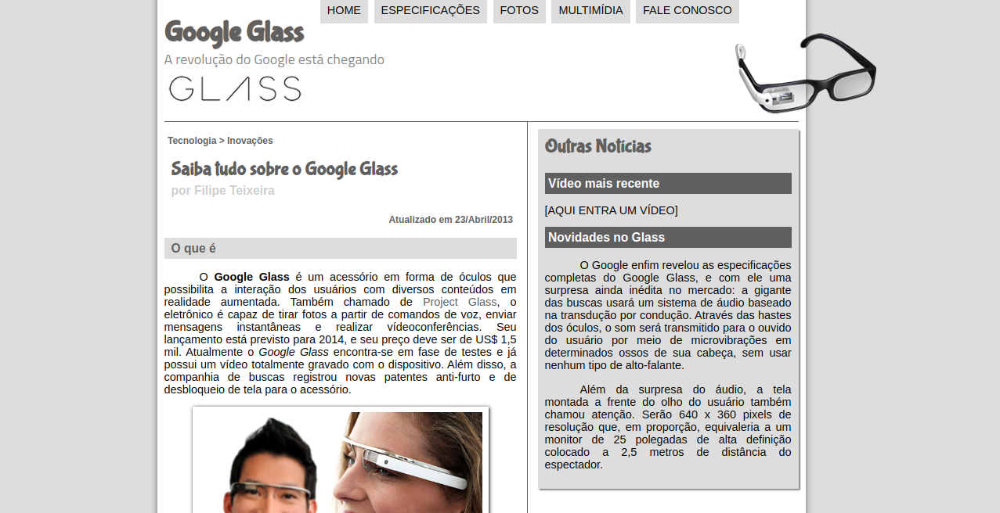

<p align="center">
  
</p>

<p align="center">
  <a href="#-technologies">Technologies</a> •
  <a href="#-getting-started">Getting started</a> •
  <a href="#-license">License</a>
</p>

<p align="center">
  
</p>

## 🚀 Technologies

- [HTML5](https://developer.mozilla.org/en-US/docs/Web/HTML)
- [CSS3](https://developer.mozilla.org/en-US/docs/Web/CSS)
- [JavaScript](https://developer.mozilla.org/en-US/docs/Web/JavaScript)

## 💻 Getting started

### Requirements

- [Browser](https://brave.com/)

**Clone the project and access the folder**

```bash
git clone https://github.com/filipebteixeira98/google-glass-newsletter.git && cd google-glass-newsletter
```

**Follow the steps below**

```bash
# Open source file on default browser
$ xdg-open index.html
```

## 📝 License

This project is licensed under the MIT License - see the [LICENSE](LICENSE) file for details.

---

<p align="center">
  Made with 💜 by <a href="https://www.linkedin.com/in/filipebteixeira98/">Filipe Teixeira</a>
</p>
